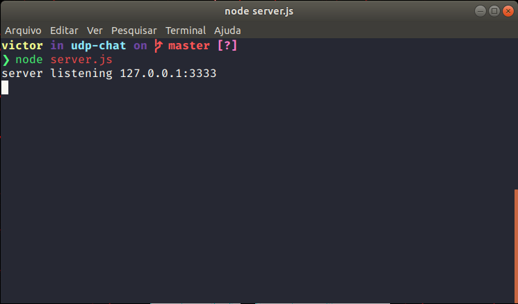
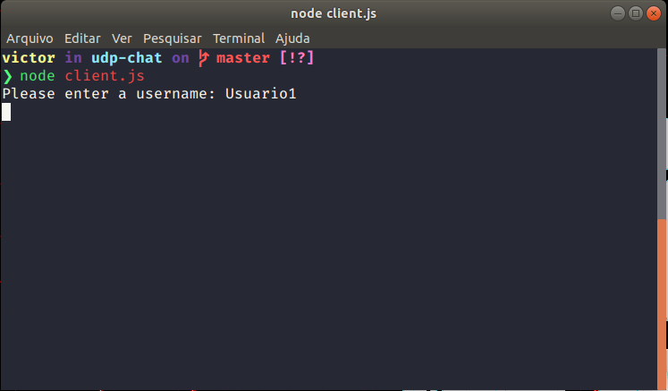
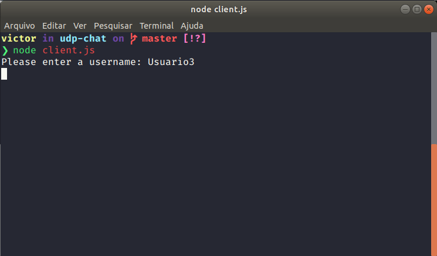
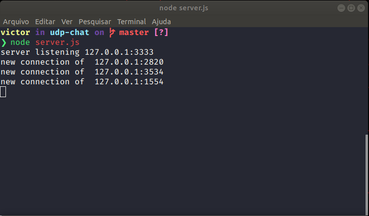
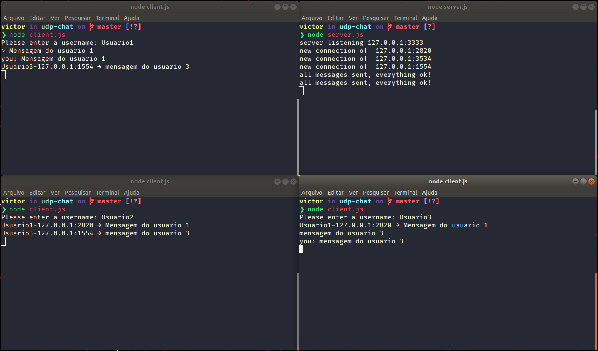

## Realtime-Chat with Node.js, Socket and UDP Protocol

#### Examples:

> Server starting:
> 

> Clients connections:
>  >  >  > 

> Chat:
> 

### Running server

> node server.js

### Running client

> node client.js

#### Based on

Node Docs: see documentation [here](https://nodejs.org/api/dgram.html)
